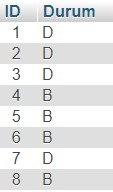

# park-alani
Demoyu görüntülemek için AkilliOtopark.exe dosyasını çalıştırın. 
Dosyanın çalışabilmesi için yerel sunucu kurulu ve otopark adlı bir database oluşturulması gereklidir. 
Park isimli bir table oluşturun ve içeriğini aşağıdaki gibi yapın.  
 

Sunucu için AkilliOtopark.py ve index.php dosyalarının içindeki database bağlantılarının düzenlenmesi gereklidir.

**Not**: Eğer PyCharm kullanıyorsanız yeni proje açıp kodları yapıştırdıktan sonra düzenleyin. 
Ayrıca PyCharm için File>Settings>Project:'Proje Adı'>Project Interpreter tıkladıktan sonra sağda bulunan + simgesine tıklayıp  
opencv-python ve pymysql kütüphanelerinin eklenmesi gerekir.  

**DEMO** 

